# 01. Жизненный цикл ПО

### Создаём нужные статусы issue:

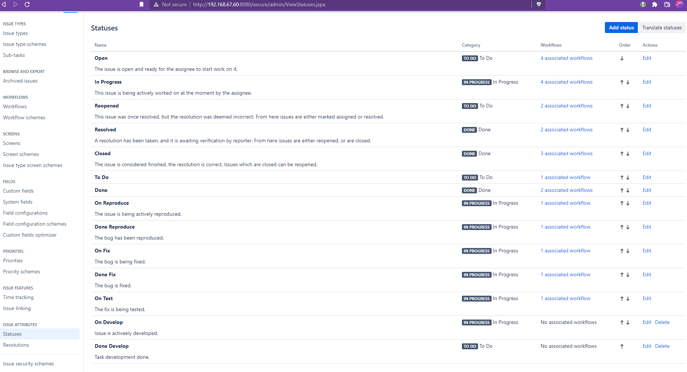

### Создаём workflow для типа bug:

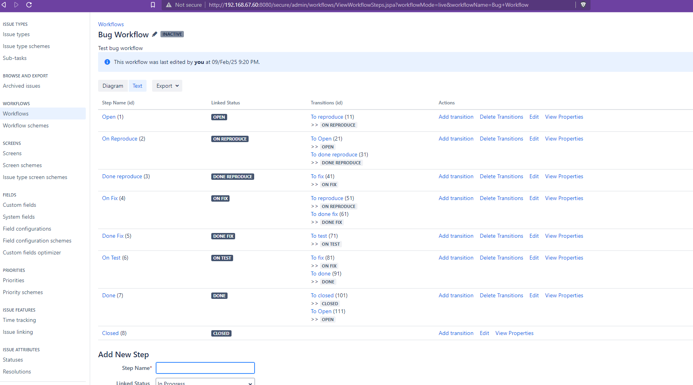

### Создаём workflow для остальных типов:

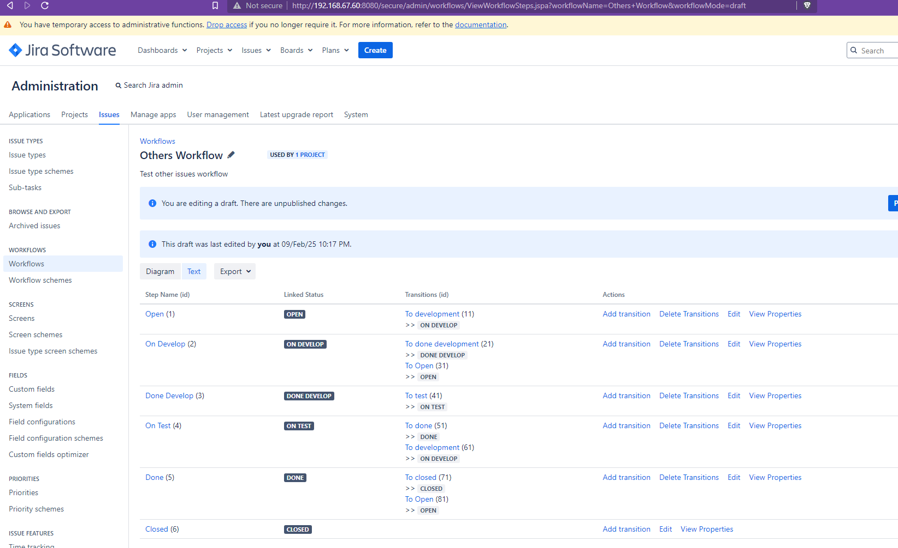

### Создаём workflow схему:

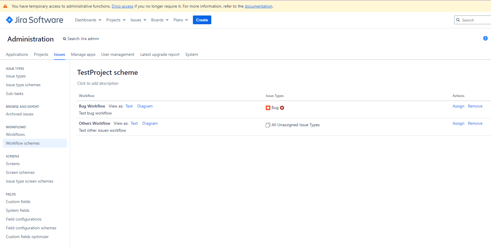

### Создаём проект:

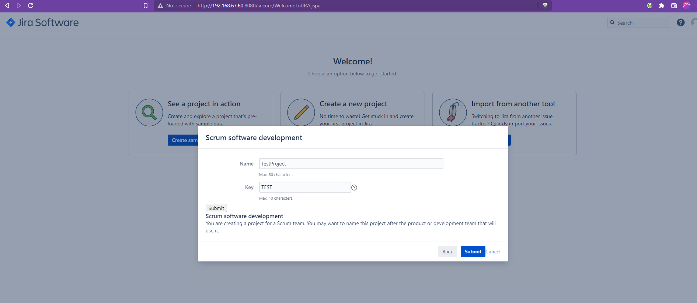

### Назначаем ему нашу схему:

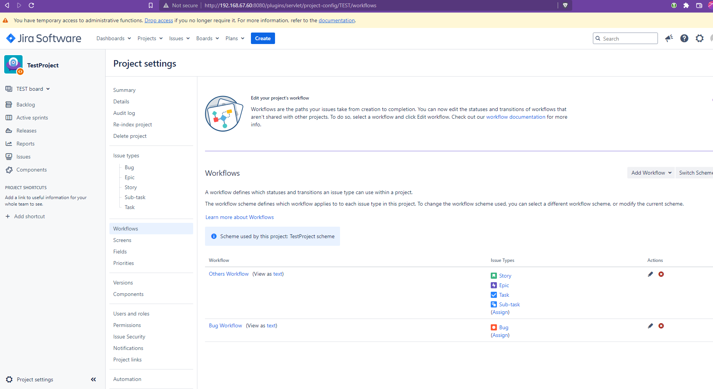

### Заводим несколько задач с типом bug, epic и  task

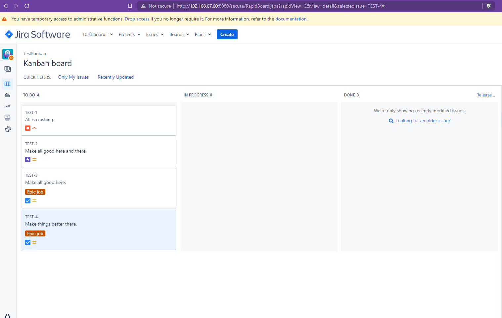

### Проводим их по всем состояниям:

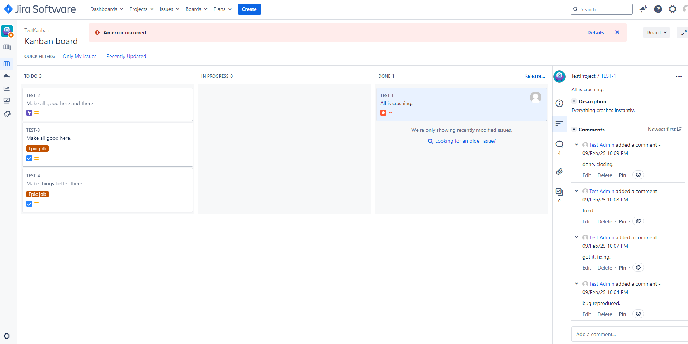

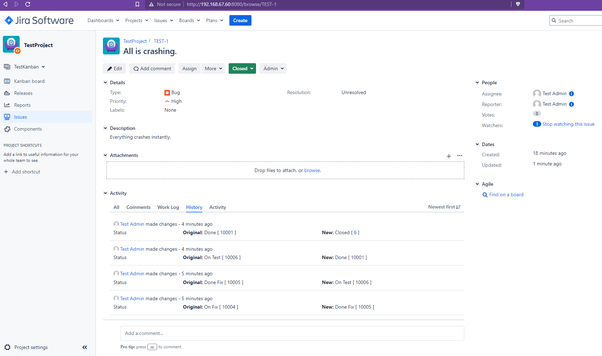

### Создаём новый спринт:

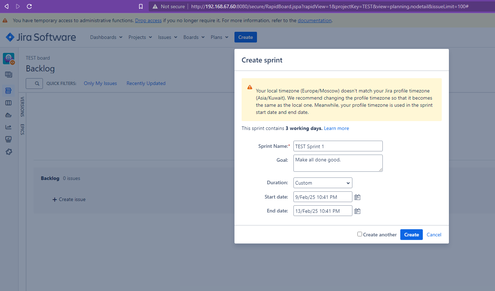

### Добавляем задачи и стартуем:

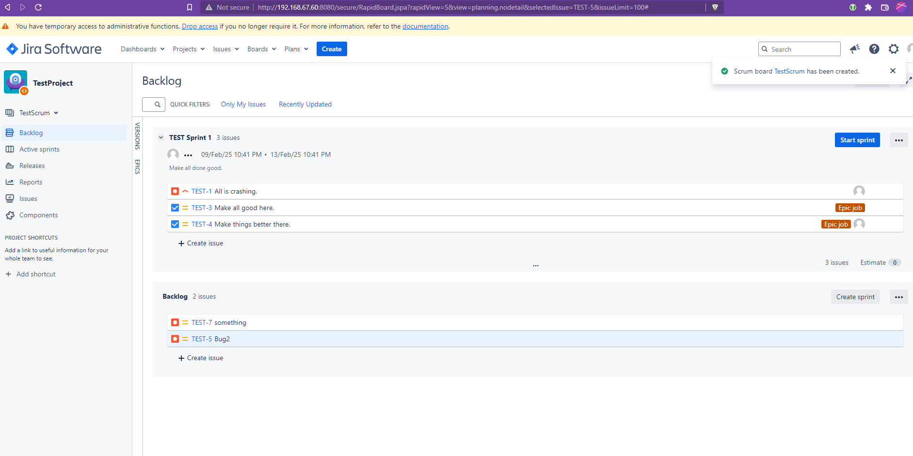

### Проводим Задачи по всем состояниям:

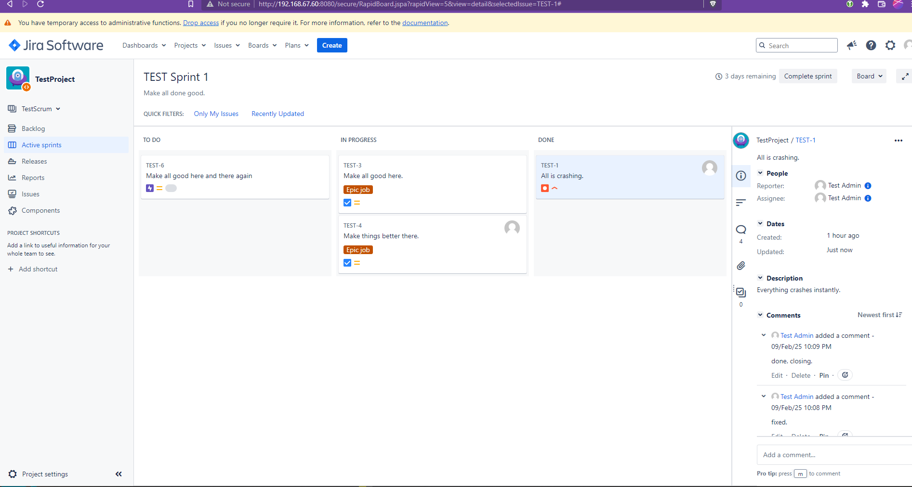
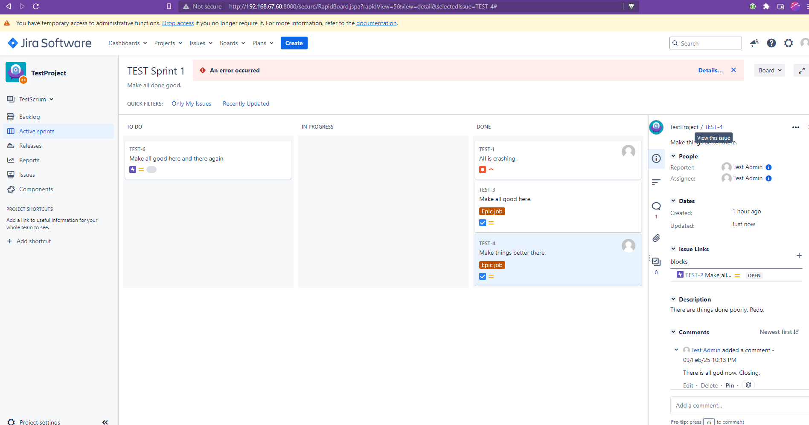

### Закрываем спринт:

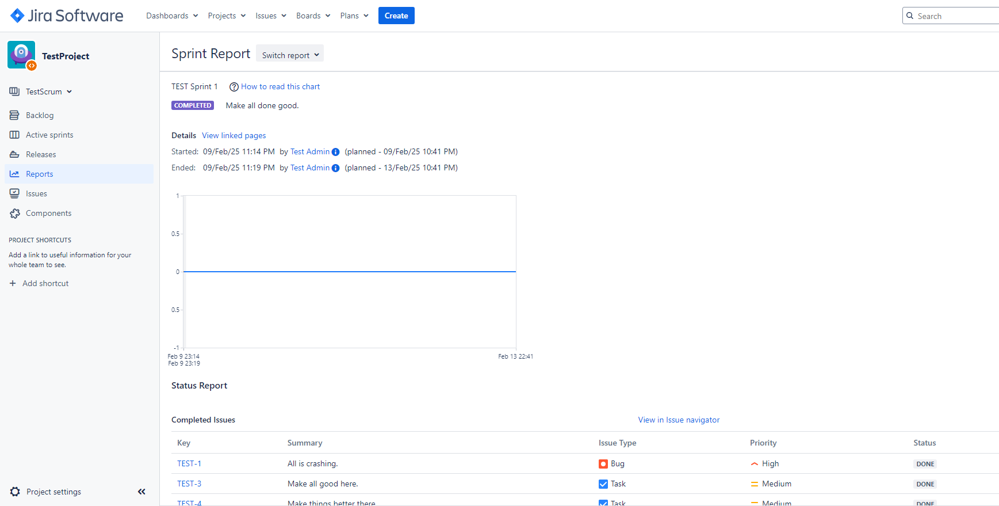

### Файлы экспорта:

[Bug_Workflow.xml](src/Bug_Workflow.xml) и [Others_Workflow.xml](src/Others_Workflow.xml).