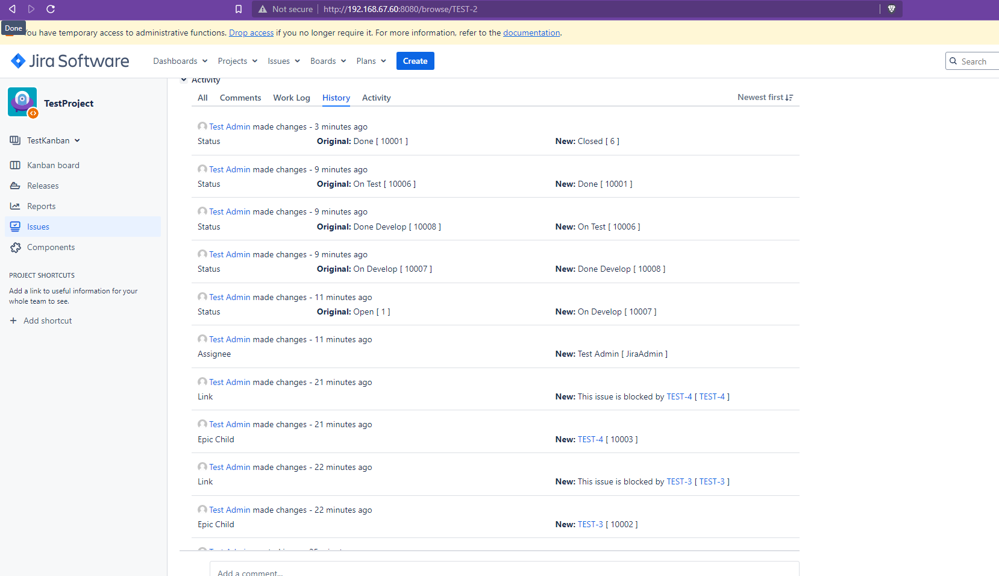

# 01. Жизненный цикл ПО

### Создаём нужные статусы issue:

### Создаём workflow для типа bug:

### Создаём workflow для остальных типов:

### Создаём workflow схему:

### Создаём проект:

### Назначаем ему нашу схему:

### Заводим несколько задач с типом bug, epic и  task

### Проводим их по всем состояниям:

### Создаём новый спринт:

### Добавляем задачи и стартуем:

### Проводим Задачи по всем состояниям:

### Закрываем спринт:

### Файлы экспорта:

[Bug_Workflow.xml](src/Bug_Workflow.xml) и [Others_Workflow.xml](src/Others_Workflow.xml).