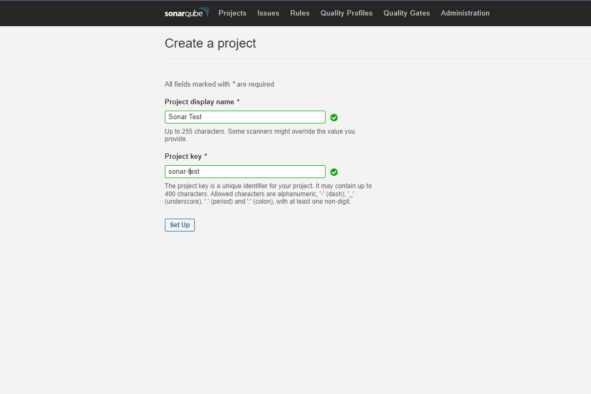
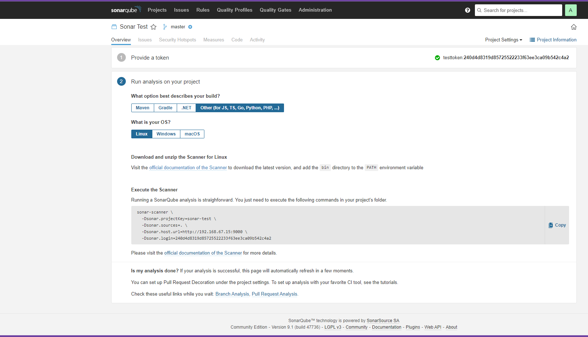
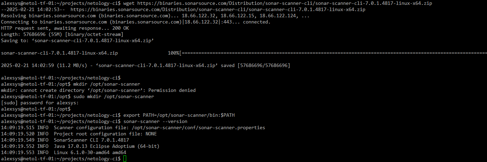
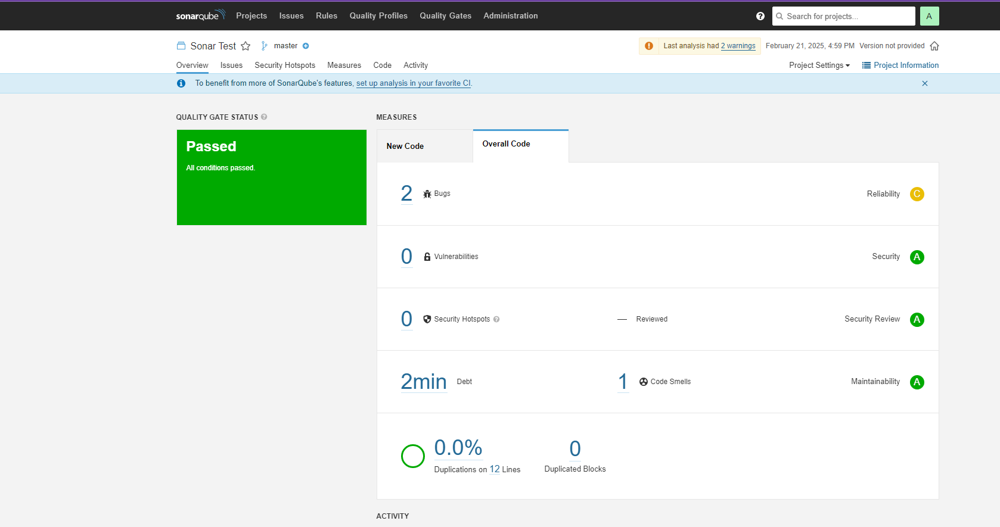
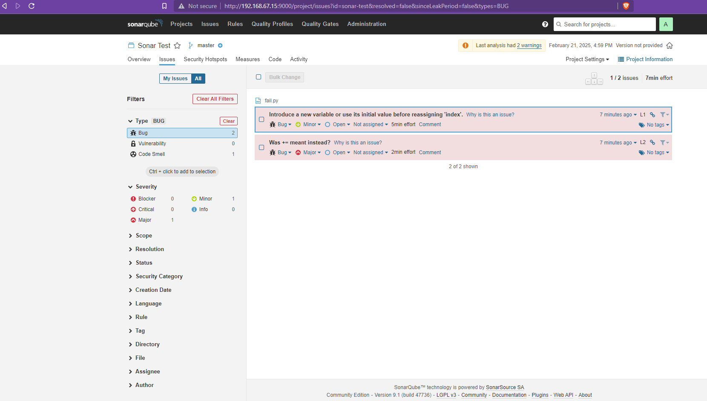
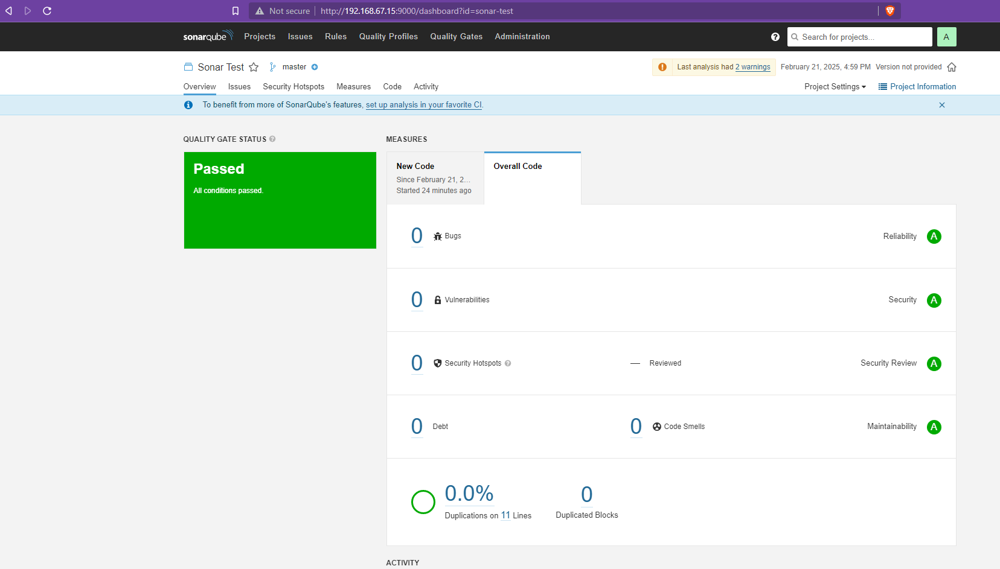
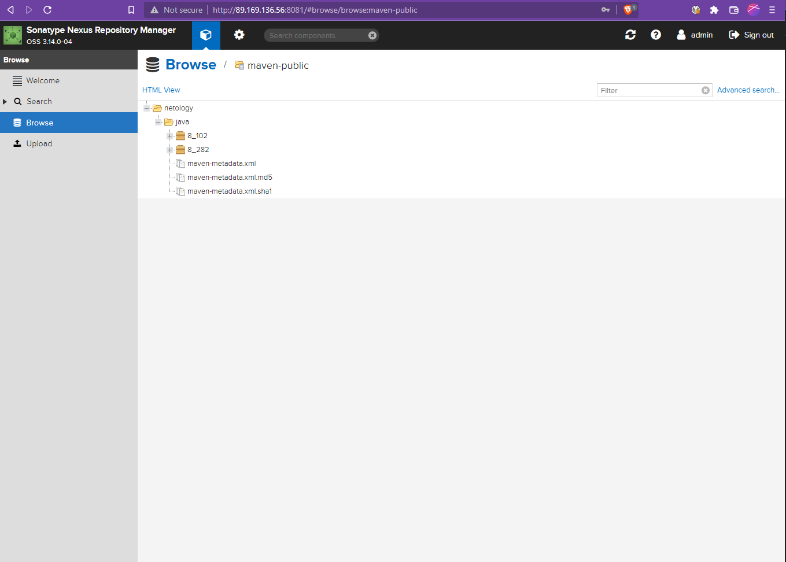
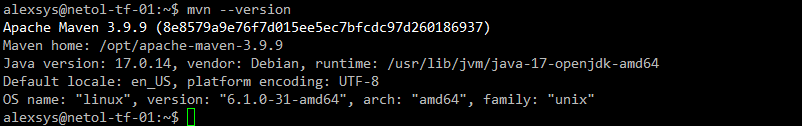
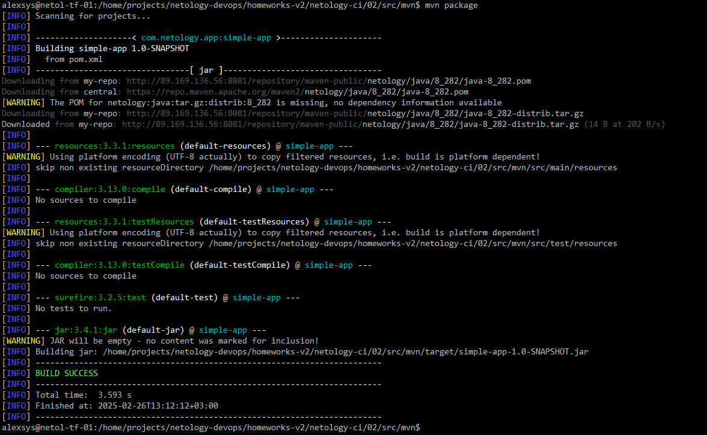

# Процессы CI/CD

## SonarQube

Создаём новый проект:

Устанавливаем sonar-scanner:

Запускаем скан на тестовом файле:

Обнаружили ошибки:

Исправляем, сканируем снова:

## Nexus

Добавляем две версии тестового артифакта:

Файл [maven-metadata.xml](src/mvn/maven-metadata.xml)

## Maven

Устанавливаем Maven:

Изменяем файл [pom.xml](src/mvn/pom.xml), чтобы он использовал наш репозиторий и артефакт, и собираем:

