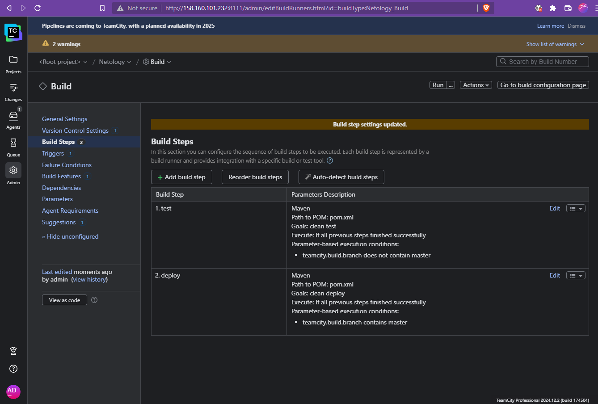

# Teamcity

## Устанавливаем TeamCity


Добавляем агент:


## Создаём проект и добавляем шаги сборки

Создаём сборку, которая будет собирать наш тестовый проект из репозитория [https://github.com/Alex-AVS/example-teamcity.git](https://github.com/Alex-AVS/example-teamcity.git)


Запускаем первую сборку:


Добавляем условия сборки для deploy и test, Меняем pom.xml и settings.xml



Собираем снова:


Собранный артефакт в Nexus:


_Пункт "8. Мигрируйте build configuration в репозиторий." - **не понятен**._ Единственное, что _относительно_ подходит под определение - 
это пункт `Administration - Configs repository` глобальных настроек ТС. 
Но, этого **нельзя делать** в публичный репозиторий, о чём прямо написано на странице настроек:


При этом в репозиторий синхронизируется всё, включая загруженные ключи и пароли! Github автоматически блокирует найденный ключ.

Конфигурация, сохранённая в ветке репозитория:


Создаём новую ветку в тестовом репозитории, добавляем новый метод `sayHungry` в класс

```
public String sayHungry(){
		return "As hungry as a hunter!";
	}
```

и соответствующий метод в тест:

```
@Test
	public void welcomerSaysHungry(){
		assertThat(welcomer.sayHungry(), containsString("hunter"));
	}

```
Коммитим, проверяем, что сборка test запустилась:


Тесты пройдены


Настраиваем путь до артефактов:


Собираем master. Артефакты появились в результатах:


